
<h1 align="center">政务大厅管理系统+vue</h1>

## 简介
政务大厅管理系统：角色分为管理员、用户；个人中心、论坛管理、轮播图管理、资料管理、公积金管理、医保卡管理、投诉处理等功能模块，支持支付与信息交互。    --计算机毕业设计源码；毕设源码；java毕业设计源码

## 联系方式

<h3 align="center">获取完整代码与数据库文件 + 微信：deepguan QQ: 86050149 QQ群: 783742310</h3>

<h3 align="center">可帮忙远程部署 包运行成功！提供远程部署、修改代码、设计文档指导、代码讲解等服务！</h3>

## 功能介绍（完整见运行截图）
管理员： 管理系统界面提供灵活的模块导航，包括个人中心、建筑信息、设备管理等。管理员可以管理用户信息并进行各种运营操作，如轮播图管理、论坛和资料管理等。支持上传资料、编辑和删除等功能，确保信息更新。管理不同类别的论坛帖子并处理举报信息。能在公告模块发布重要信息，同时有权查看和调整用户数据，确保系统的正常运行和安全。

用户： 在“个人中心”页面，用户可以查看和编辑个人信息，如账户名、手机号及身份证号，更新头像信息。用户可通过选择微信、支付宝或银行等支付方式进行缴费操作，管理公积金和医保卡余额。论坛模块允许用户浏览和发布帖子，参与讨论与交流，同时可通过举报功能反馈问题。用户还可以提交建议，通过领导信箱或网络信箱进行沟通，所有操作确保信息及时处理与反馈。

## 运行截图
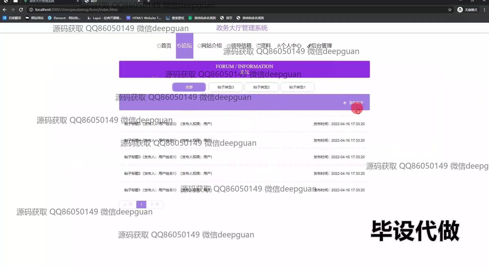
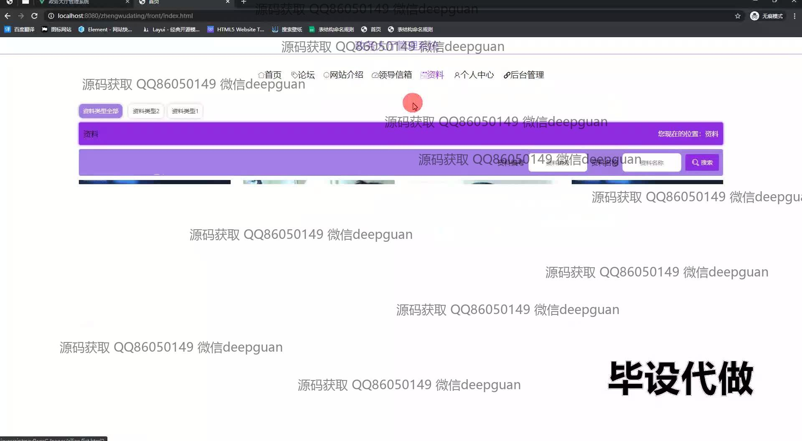
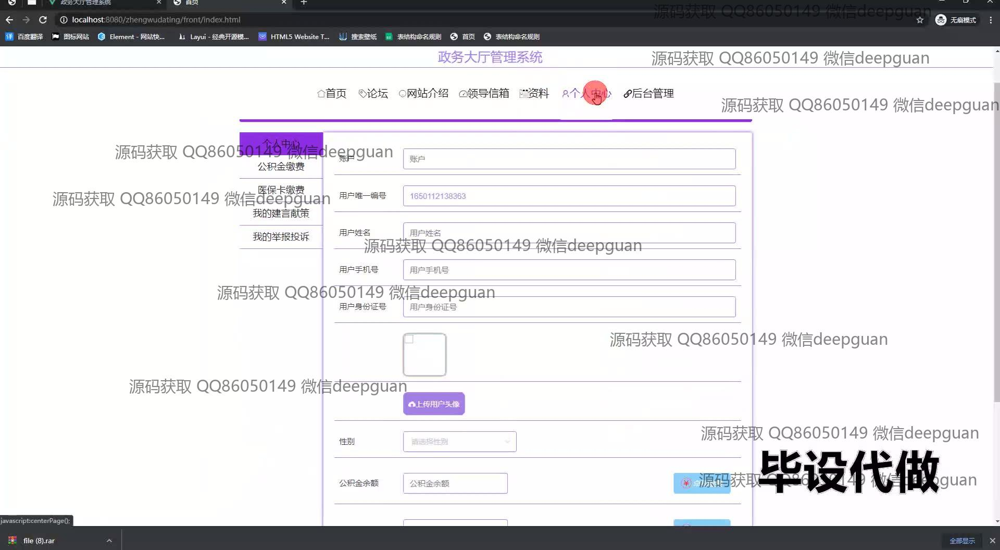
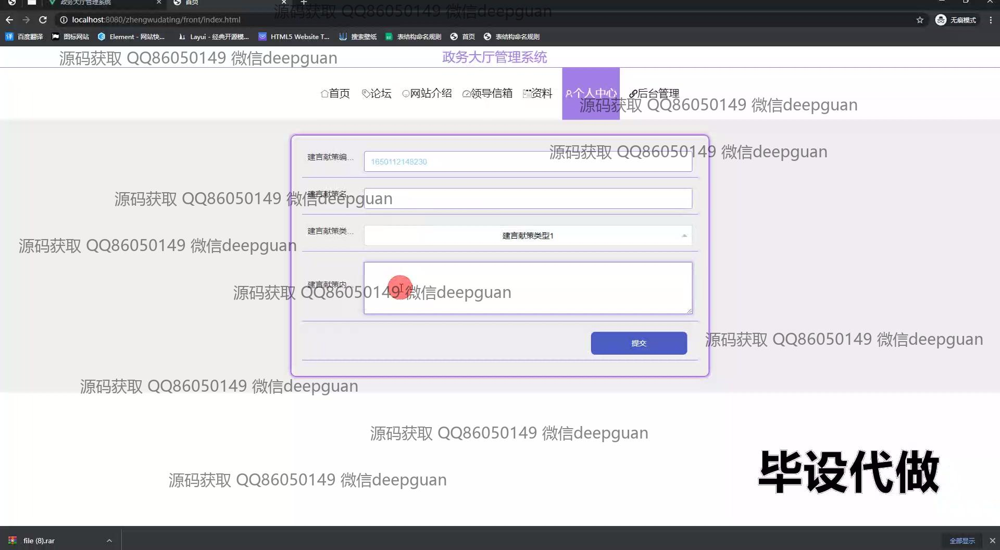
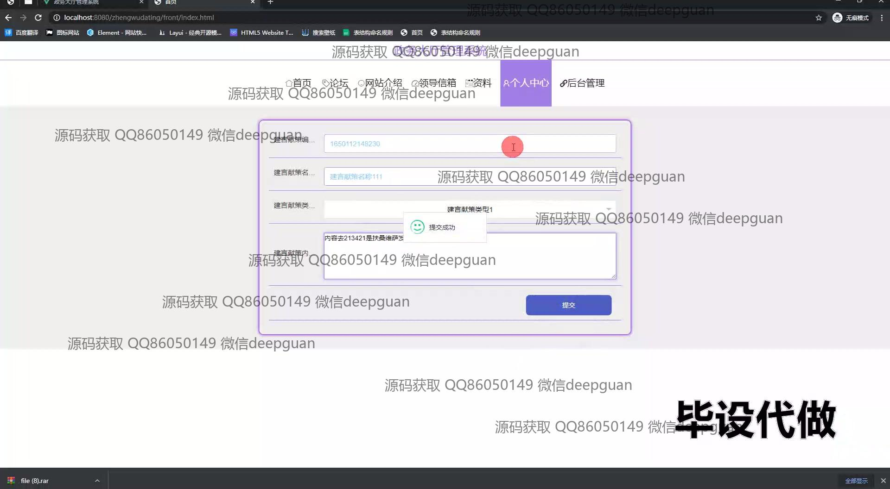
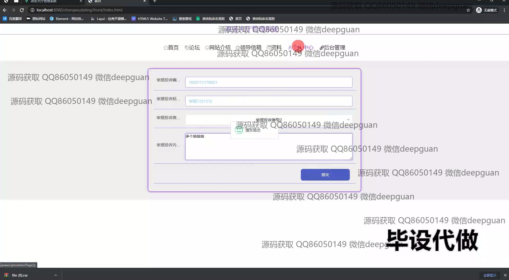
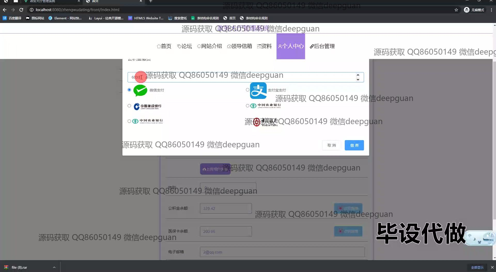
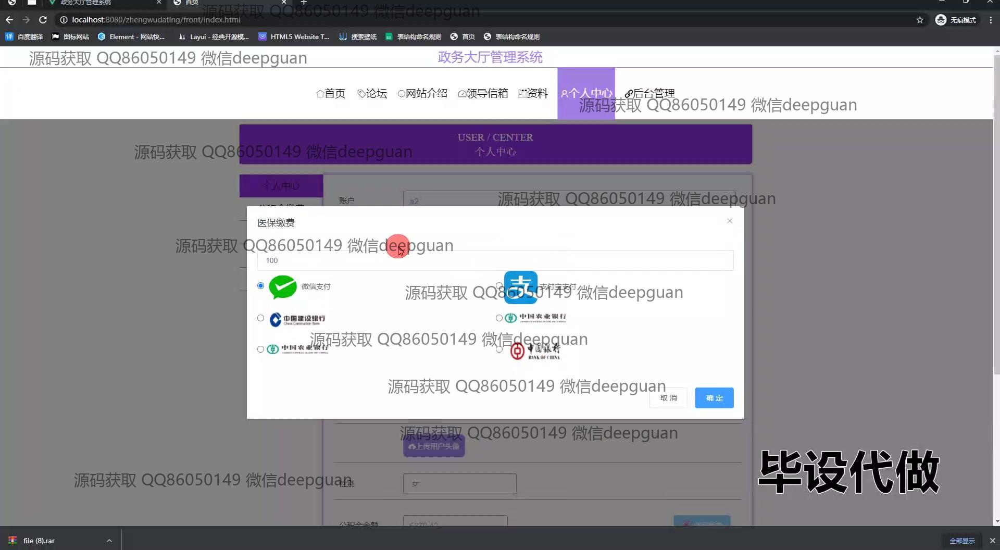
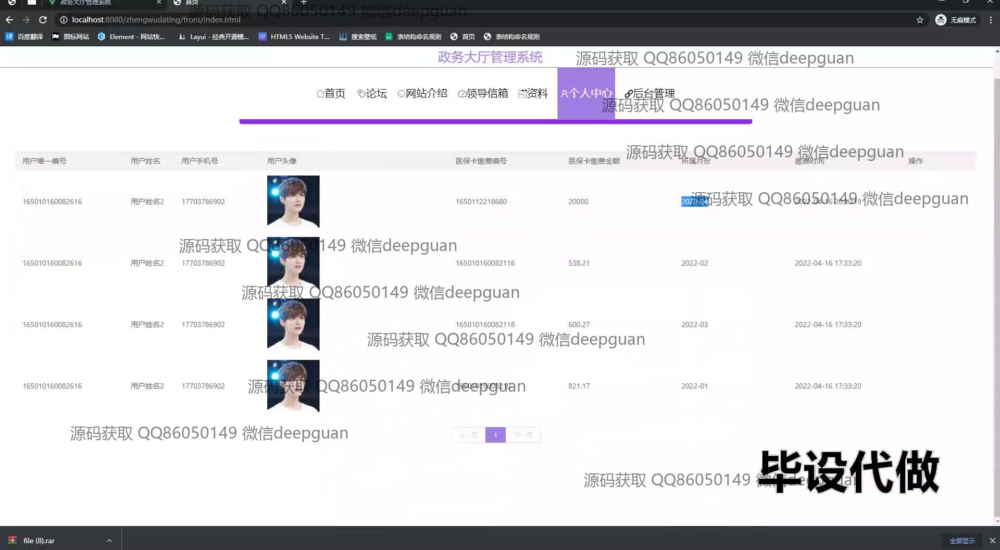
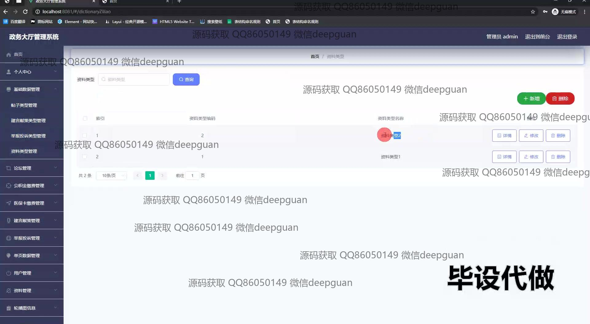
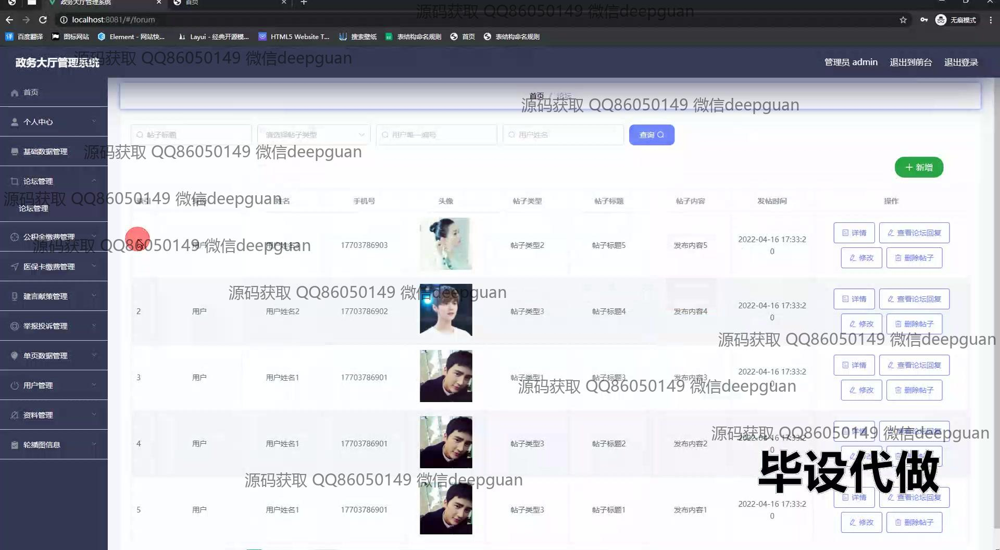
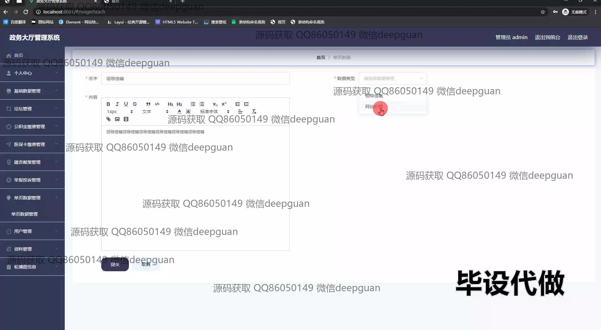
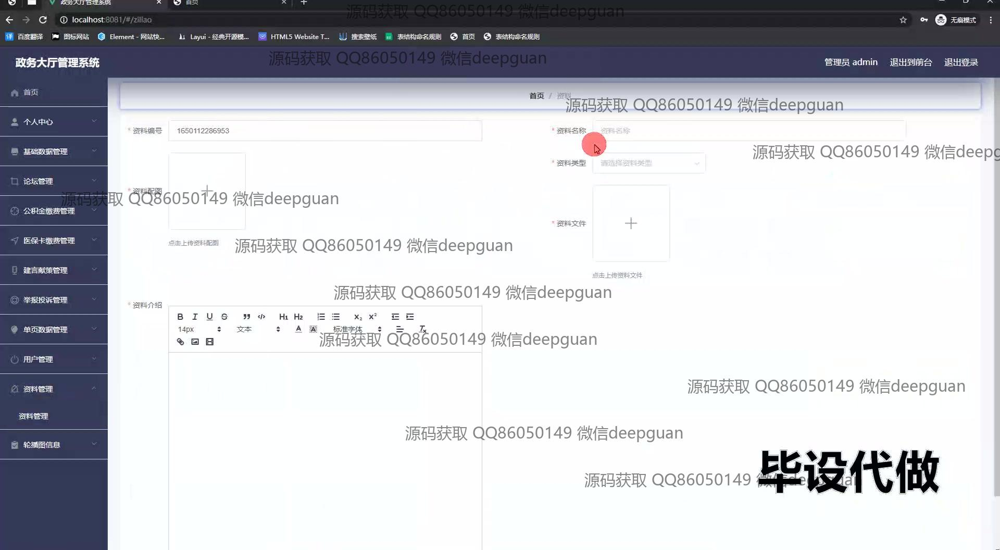
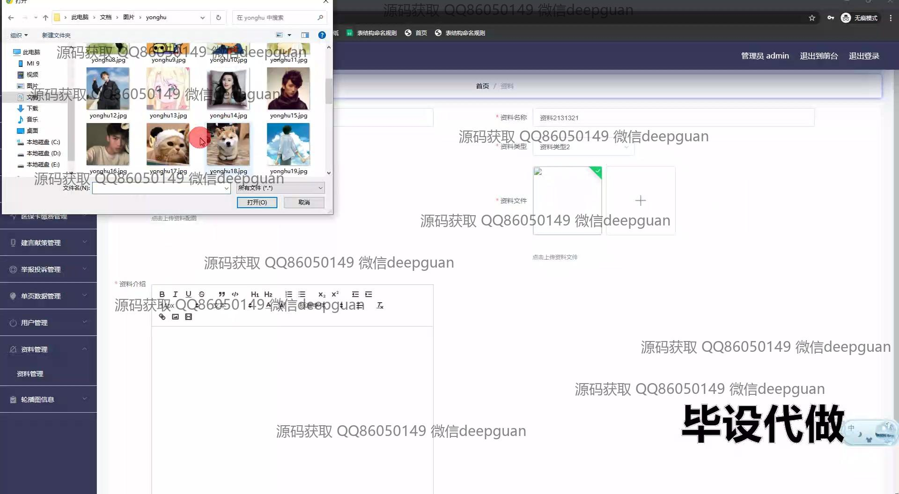
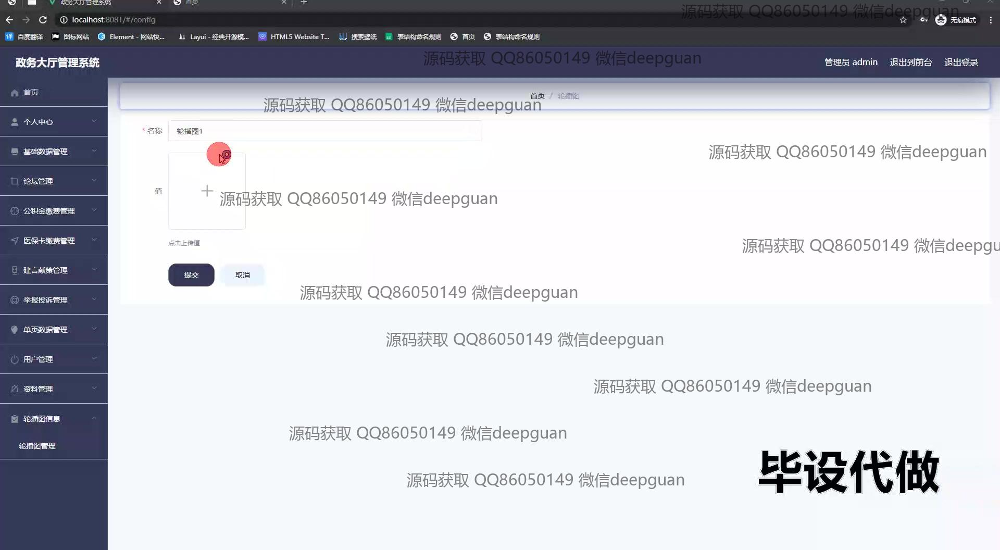
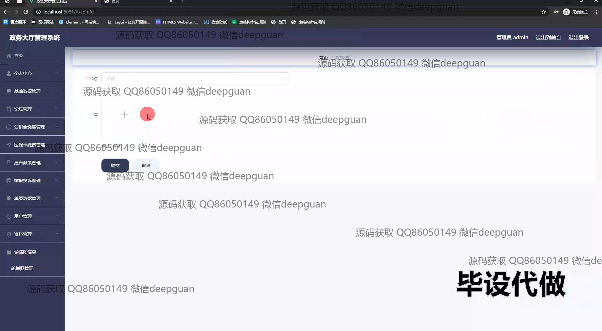
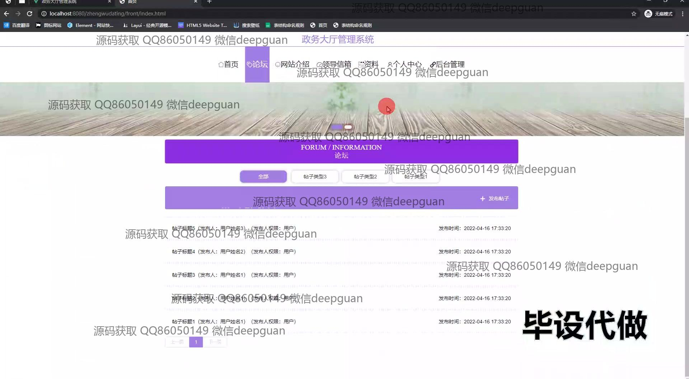
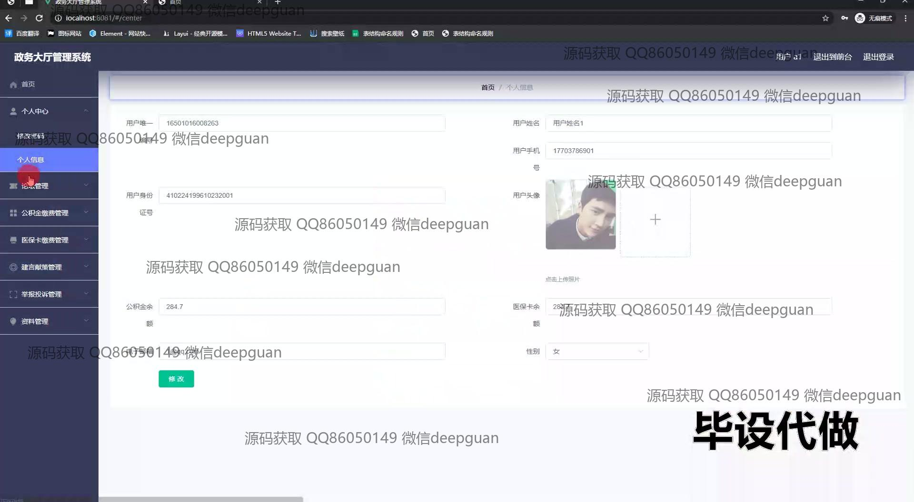
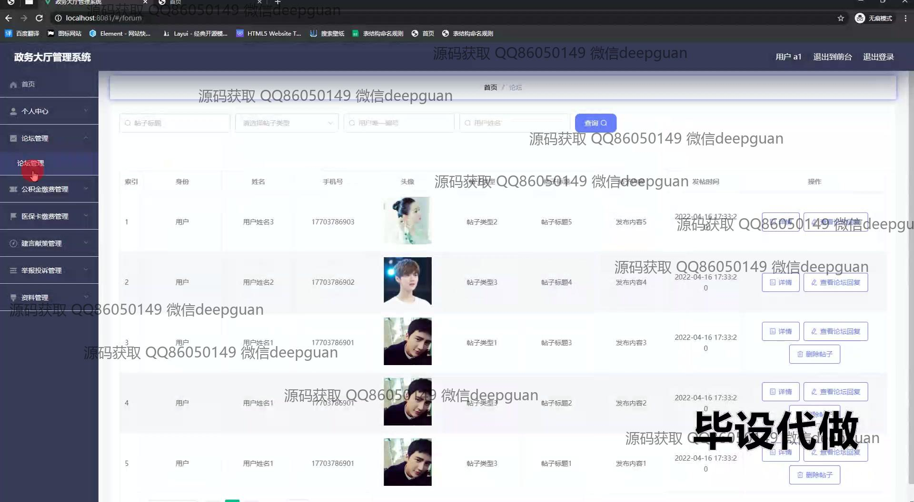

本代码来源于网络,仅供学习参考使用!

